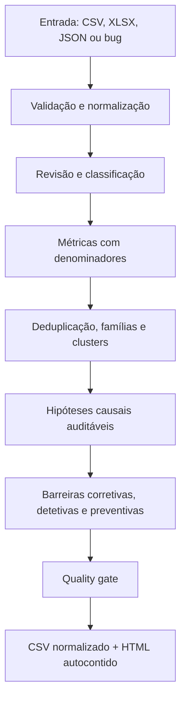

# RCA Agent Lab

Um agente orquestrador e um conjunto de skills para transformar bugs em um RCA por cluster, rastreável da linha de origem até a barreira recomendada. O usuário fornece um arquivo; o agente devolve um CSV normalizado e um dashboard HTML autocontido.



## Por que um agente e várias skills

Métricas, parsing e HTML são determinísticos e testáveis; não ganham qualidade por virarem “agentes”. O orquestrador usa skills onde contexto e julgamento importam: revisar classificação, relacionar evidências, testar hipóteses e criar ações específicas.

## Uso direto, sem LLM

```bash
python -m pip install -e ".[dev]"
npm run rca -- analyze data/input/bugs-demo.csv --output reports/demo
```

Saída: `reports/demo/bugs-normalized.csv` e `reports/demo/rca-report.html`.

## Uso com Codex

```text
Use $analyze-rca para analisar C:\dados\bugs.xlsx e gerar o RCA HTML.
```

O `AGENTS.md` conduz `prepare → revisão semântica → finalize → validate`.

## Uso com GitHub Copilot

Selecione o agente `rca-orchestrator` em `.github/agents/rca-orchestrator.agent.md` e envie:

```text
Analise ./data/input/bugs-demo.csv
```

As skills ficam em `.agents/skills`, localização reconhecida pelos dois ambientes.

## Modos

```bash
npm run rca -- report-bug --input evidence.json --output reports/bug
npm run rca -- prepare data/bugs.xlsx --output reports/run
npm run rca -- finalize --work .rca-work/<run> --review agent-review.json --output reports/run
npm run rca -- analyze data/bugs.xlsx --output reports/run --mode rules
npm run rca -- validate reports/run/rca-report.html
```

`rules` produz uma linha de base offline e reproduzível. No fluxo agentic, o modelo escreve somente `agent-review.json`; números, renderização e quality gate continuam no núcleo Python.

## Rastreabilidade

O HTML contém resumo executivo, cards de KPI e uma seção detalhada para **cada indicador** com definição, fórmula, denominador, insight, análise, bugs de apoio e limitações. Também inclui gráficos Plotly autocontidos para evolução, severidade, tipo, ambiente, módulo, sinais RCA, cruzamentos, palavras-chave, clusters priorizados, hipóteses, evidências, perguntas, barreiras e a cadeia bug → cluster → hipótese → ação.

O agente pode aprofundar os textos de cada KPI por `narrative.kpi_reviews`; o núcleo determinístico preserva o valor calculado e a rastreabilidade.

Valores reportados são preservados. Sugestões do agente ficam em colunas próprias com confiança, racional e status de revisão.

## Desenvolvimento

```bash
npm run demo
npm run check
```

Hipótese nunca é causa confirmada.
