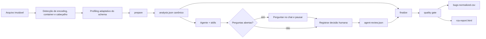

# Arquitetura

## Decisão principal

Há um agente orquestrador e skills especializadas, mas apenas um núcleo de execução. Ingestão, normalização de valores reportados, métricas, clustering inicial, renderização e quality gate são Python determinístico. O agente produz um overlay semântico validado por schema.



## Fronteiras

- `analysis.json` é a base numérica e rastreável.
- `source_fields` preserva todas as colunas e valores da organização.
- `data_quality.schema_mapping` registra coluna original, campo canônico, método, score, confiança, alternativas e status.
- Mapeamentos exatos seguem automaticamente; mapeamentos de confiança média param no gate humano.
- Taxonomias próprias nunca caem em `unknown` apenas por não existirem no catálogo local.
- Valores `effective_*` alimentam métricas após confirmação, sem alterar o valor reportado.
- `agent-review.json` é a única superfície escrita pelo LLM.
- O template de review nasce sem narrativa, insights, hipóteses ou ações. O núcleo não contém frases causais nem matrizes de ações de fallback.
- Decisões analíticas ficam em configurações versionadas: `kpis.yml`, `descriptive-analysis.yml`, `clustering.yml`, `schema-mapping.yml`, `confidence-rules.yml`, `evidence-reliability.yml`, `action-policy.yml` e `quality-policy.yml`.
- O código valida essas configurações e não substitui ausência ou erro por limiar, peso, fórmula ou estimativa embutida.
- Campos ausentes de severidade, bug type ou categoria RCA não recebem sugestão por palavras-chave. O agente propõe cada valor no review, registra confiança e racional e solicita aprovação humana.
- O review não pode redefinir evidência existente nem sobrescrever classificação reportada.
- `finalize` bloqueia perguntas com status `open`. Quando uma revisão semântica é solicitada, também bloqueia se narrativa, insights, hipóteses ou ações estiverem vazios ou sem evidência.
- O HTML incorpora o objeto canônico usado para todas as seções.

## Enriquecimento opcional

Código, Git, PRs, logs e observabilidade entram como novas evidências no review. São opcionais e precisam de referência reproduzível. Métricas metodológicas só são renderizadas quando possuem `evidence_ids`; cobertura, complexidade, DORA e disponibilidade nunca são presumidas a partir do CSV. O relatório registra fontes consultadas, indisponíveis ou não solicitadas.

## O que deliberadamente não existe

Não há um “agente de métricas” ou “agente de dashboard”: ambos seriam variáveis onde se exige exatidão. Não há chamadas externas no HTML. Não há promoção automática de hipótese para causa confirmada.

## Responsabilidades no código

- `analysis/` contém normalização, classificação, clustering e extração determinística de evidências. Interpretação causal pertence ao agente.
- `core/` concentra configuração, schemas, exceções e utilitários compartilhados.
- `ingestion/` seleciona leitores por extensão. Novos formatos implementam `RecordReader` sem alterar o dispatcher.
- CSV detecta UTF-8, UTF-16 e CP1252, delimitador e linha real de cabeçalho. XLSX seleciona planilha e cabeçalho; JSON encontra coleções aninhadas e achata objetos para profiling.
- Lead time de detecção usa duração reportada ou `detected_at - occurrence_started_at`; nunca usa criação do ticket como início da ocorrência.
- `resolved_at - created_at` mede o ciclo do ticket. Tempo de restauração do serviço requer timestamps operacionais próprios e não é inferido do ticket.
- `analysis/schema_mapping.py` combina aliases, similaridade de cabeçalho e perfil dos valores, sempre com confiança auditável.
- Clusters usam ligação completa para evitar encadeamento por elo único. Permanecem candidatos com confiança `unvalidated` até avaliação em dados rotulados; casos limítrofes ficam no objeto canônico e no HTML.
- Notas QA/Dev começam com confiabilidade `unassessed` e papel `reported_causal_signal`; fonte textual não recebe confiabilidade alta automaticamente.
- A cobertura desses sinais é um KPI de disponibilidade, não um score de qualidade. `metrics.causal_signal_patterns` cruza os bugs com notas pelas dimensões configuradas, e `narrative_inputs.causal_signal_context` entrega todas as notas ao agente com `bug_id`, `evidence_id` e origem.
- Notas não entram na similaridade que gera candidatos a duplicidade. Em uma camada semântica separada, recorrência independente, convergência QA/Dev e coerência com os demais indicadores podem sustentar forte hipótese. Confiança causal alta continua bloqueada sem validação reproduzível.
- Horas de retrabalho são opcionais e só passam pelo gate com método, hipóteses e evidências reproduzíveis.
- A política exige ao menos uma ação específica por hipótese, mas não fabrica exatamente três tipos de controle.
- `metrics/` separa primitivas, cálculos de KPI, definições factuais e a fachada `calculate_metrics`.
- `pipeline/` coordena casos de uso, revisão semântica e expõe fachadas compatíveis para a CLI.
- `quality/` executa checks independentes por meio de `QualityGate`.
- `reporting/` separa CSV, gráficos, metodologia, estilos, dashboard e validação dos artefatos.

As dependências externas do orquestrador (ingestão, schema e quality gate) são injetáveis. Os pontos de entrada funcionais permanecem como fachadas para preservar compatibilidade.

O check estrutural impede módulos Python acima de 400 linhas e funções acima de 100 linhas. Esses limites não substituem revisão arquitetural, mas evitam a volta de módulos e funções monolíticos.

```text
src/rca_agent/
├── analysis/
├── core/
├── ingestion/
├── metrics/
├── pipeline/
├── quality/
├── reporting/
├── cli.py
└── __main__.py
```

