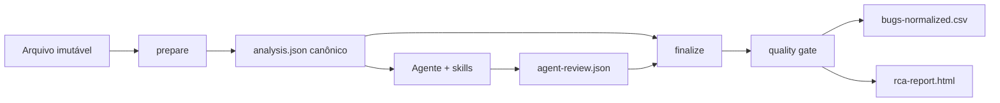

# Arquitetura

## Decisão principal

Há um agente orquestrador e nove skills, mas apenas um núcleo de execução. Ingestão, normalização, classificação por regras, métricas, clustering inicial, renderização e quality gate são Python determinístico. O agente produz um overlay semântico validado por schema.

## Fronteiras

- `analysis.json` é a base numérica e rastreável.
- `agent-review.json` é a única superfície escrita pelo LLM.
- O review não pode redefinir evidência existente nem sobrescrever classificação reportada.
- `finalize` valida schema, integridade referencial e causalidade.
- O HTML incorpora o objeto canônico usado para todas as seções.

## Enriquecimento opcional

Código, Git, PRs, logs e observabilidade entram como novas evidências no review. São opcionais e precisam de referência reproduzível. O relatório registra fontes consultadas, indisponíveis ou não solicitadas.

## O que deliberadamente não existe

Não há um “agente de métricas” ou “agente de dashboard”: ambos seriam variáveis onde se exige exatidão. Não há chamadas externas no HTML. Não há promoção automática de hipótese para causa confirmada.

